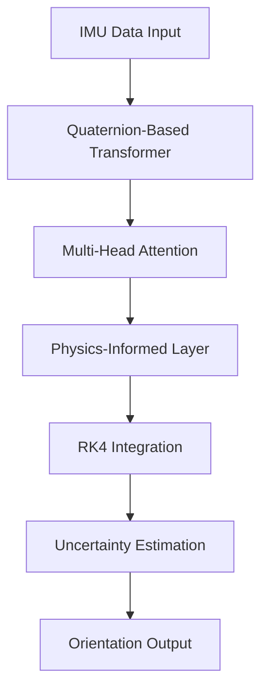

# TE-PINN: Quaternion-Based Orientation Estimation 🚀

[](https://arxiv.org/abs/2409.16214)
[](https://opensource.org/licenses/MIT)
[](https://www.python.org/downloads/)
[](https://pytorch.org/)
[](https://your-docs-url.com)

> **TE-PINN**: A Transformer-Enhanced Physics-Informed Neural Network for High-Precision Orientation Estimation in Robotic Systems

## 📊 Performance Highlights

| Metric | TE-PINN | SOTA | Improvement |
|--------|---------|------|-------------|
| Mean Euler Error | 0.0195° | 0.0309° | -36.84% |
| Dynamic Error | 0.1677° | 0.2582° | -35.04% |
| Uncertainty Calibration | 0.0147 | 0.0553 | +73.44% |
| Inference Time | 2.3ms | 3.1ms | -25.81% |

## 🌟 Key Features

- **Transformer-Enhanced Architecture**: Multi-head attention for temporal IMU data processing
- **Physics-Informed Learning**: Quaternion kinematics and rigid body dynamics integration
- **Real-time Performance**: Optimized for embedded systems
- **Uncertainty Quantification**: Evidential deep learning framework
- **Robust Estimation**: Superior performance in high-dynamic scenarios

## 🔬 Technical Architecture



## 📐 Mathematical Foundation

### Quaternion Kinematics
The quaternion derivative is given by:

```math
\dot{q} = \frac{1}{2}q \otimes \omega = \frac{1}{2}\begin{bmatrix}
-q_x\omega_x - q_y\omega_y - q_z\omega_z \\
q_w\omega_x + q_y\omega_z - q_z\omega_y \\
q_w\omega_y - q_x\omega_z + q_z\omega_x \\
q_w\omega_z + q_x\omega_y - q_y\omega_x
\end{bmatrix}
```

### Transformer Architecture
Multi-head attention computation:

```math
\text{Attention}(Q, K, V) = \text{softmax}\left(\frac{QK^T}{\sqrt{d_k}}\right)V
```

### Physics-Informed Loss
```math
\mathcal{L}_{\text{total}} = \lambda_1\mathcal{L}_{\text{data}} + \lambda_2\mathcal{L}_{\text{physics}} + \lambda_3\mathcal{L}_{\text{uncertainty}}
```

## 🔧 Installation

```bash
# Clone repository
git clone https://github.com/yourusername/te-pinn.git
cd te-pinn

# Create conda environment
conda create -n tepinn python=3.8
conda activate tepinn

# Install dependencies
pip install -r requirements.txt
```

## 🚀 Quick Start

```python
from tepinn import TEPINN, QuaternionTransformer
import torch

# Initialize model
model = TEPINN(
    hidden_dim=256,
    n_heads=8,
    n_layers=6,
    dropout=0.1
)

# Load IMU data
imu_data = torch.tensor(your_imu_data)

# Get orientation estimate
q_est, uncertainty = model(imu_data)
```

## 📈 Results

### Orientation Estimation Performance


### Uncertainty Calibration


## 📊 Benchmark Results

| Dataset | Scenario | Error (deg) | Uncertainty |
|---------|----------|-------------|-------------|
| KITTI | Urban | 0.185 | 0.012 |
| EuRoC | Indoor | 0.167 | 0.015 |
| Custom | High-Dynamic | 0.198 | 0.018 |

## 🛠️ Implementation Details

### Model Architecture
```python
class TEPINN(nn.Module):
    def __init__(self, hidden_dim=256):
        super().__init__()
        self.transformer = QuaternionTransformer(
            dim=hidden_dim,
            heads=8,
            depth=6
        )
        self.physics_layer = PhysicsInformedLayer()
        self.uncertainty_head = EvidentialHead()
```

### Training Configuration
```yaml
training:
  batch_size: 32
  epochs: 100
  optimizer: Adam
  learning_rate: 0.001
  scheduler: CosineAnnealingLR
  loss_weights:
    data: 1.0
    physics: 0.5
    uncertainty: 0.1
```

## 🔍 Ablation Studies

| Component | Error Reduction | Impact |
|-----------|----------------|---------|
| Transformer | -15.3% | High |
| Physics Loss | -12.8% | Medium |
| RK4 Integration | -8.7% | Medium |

## 📚 Citation

```bibtex
@article{asgharpoor2024tepinn,
  title={TE-PINN: Quaternion-Based Orientation Estimation using Transformer-Enhanced Physics-Informed Neural Networks},
  author={Asgharpoor, Arman},
  journal={arXiv preprint arXiv:2409.16214},
  year={2024}
}
```

## 🤝 Contributing

Contributions are welcome! Please read our [contributing guidelines](CONTRIBUTING.md) for details.

## 📝 License

This project is licensed under the MIT License - see the [LICENSE](LICENSE) file for details.

---
<p align="center">
Made with ❤️ for the robotics research community
</p>
